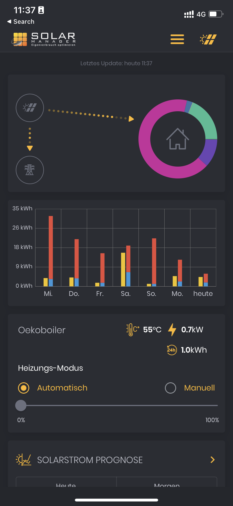
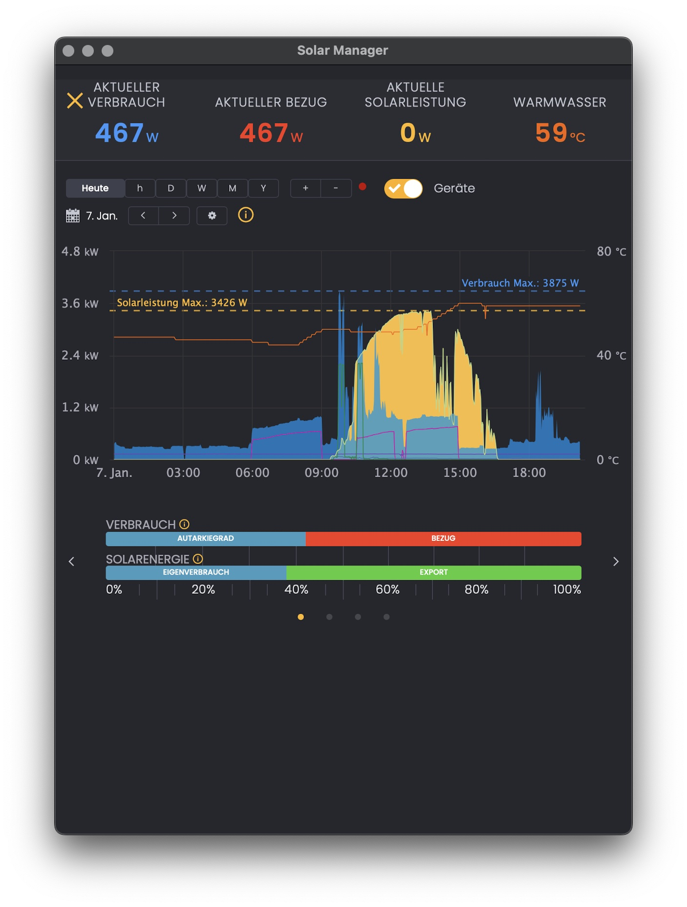

# Oekoboiler Shelly

## What is Oekoboiler Shelly, anyway?

Oekoboiler Shelly is a virtual device that emulates a Shelly 1 device, but with added functionality to connect to a [Oekoboiler](https://oekoboiler.com/en/) heat pump boiler via its [Cloud API](https://www.npmjs.com/package/tuya-cloud-api) (Based on Tuya IoT in recent / upgraded models) to retrieve data about the current water temperature, and to connect to a PV relay ([Shelly 1 or Uni](https://kb.shelly.cloud/knowledge-base/shelly-uni)) which controls an Oekoboiler’s [PV Ready](https://oekoboiler.com/produkt/rs-oekob-13-300-liter/) function. This data can be used by an external system, such as a [Solar Manager](https://solarmanager.ch), to optimize your own PV power consumption.

Oekoboiler Shelly also retrieves data about current power consumption from a [Power Meter device](https://mystrom.ch) and the current relay status from the PV relay device it controls.

This information can be used by the Solar Manager by configuring one or different Shelly 1/PM devices. For example, any combination of devices using Shelly 1/PM relay devices for

- optimised heat pump control via the ”PV-Ready” or "SG-Ready" function (`relay/0`),
- power consumption (`meters/0`), and
- temperature readout (`ext_temperature`).

A typical use case might be hot water production via the Solar Manager's **_Hot water_** / **_1 Step ON / OFF_** device using a **_Shelly 1PM_** as ”_Device (Relay)_”.

This will then allow you to measure and optimize your Oekoboiler's enerygy use and be displayed as follows, with the current water temperature, current and overall power consumption for the past 24h, and optimization control (”_PV-function_”).



## Typical readout

Once properly configured, Solar Manager will hence display the current warm water temperature along with the detailed graphs for all the devices you have configured.



Typical output generated by the virtual device at the `/status` endpoint looks as follows (simulating a Shelly 1PM):

```json
{
  "time": "20:10",
  "has_update": false,
  "ram_total": 1513185280,
  "ram_free": 786624512,
  "uptime": 3988,
  "relays": [
    {
      "ison": false,
      "has_timer": false
    }
  ],
  "meters": [
    {
      "power": 3.07,
      "is_valid": true
    }
  ],
  "tmp": {},
  "ext_sensors": {
    "temperature_unit": "C"
  },
  "ext_temperature": {
    "0": {
      "hwID": 0,
      "tC": 59,
      "tF": 138.2
    }
  }
}
```

## Requirements

It is essentially assumed that you know what you’re doing when using this software.

In terms of dependencies, you need

- [`node`](https://nodejs.org/en/) (>=v16 will do) and [`yarn`](https://yarnpkg.com)
- a server to run the software on
- a PV and heat pump boiler system to feed / control with this software

## Use

To run it, download the source code, install the dependencies (running `yarn` will do, as does `npm` if you wish), build (`yarn build`) and define the following six environment variables:

- `OB_MYSTROM_METER`: The MyStrom Switch used as a power meter for the Oekoboiler
- `OB_SHELLY_SWITCH`: The Shelly 1 used to control the Oekoboiler’s PV function
- `OB_LISTEN_IP`: The IP address to bind to. Useful if you plan to run multiple fake shellies on the same machine with multiple IP adresses
- `OB_API_CLIENT_ID`: Your Tuya API Client ID ([follow these instructions to get it](https://github.com/codetheweb/tuyapi/blob/master/docs/SETUP.md#linking-a-tuya-device-with-smart-link))
- `OB_API_CLIENT_SECRET`: Your Tuya API Client Secret (idem)
- `OB_DEVICE_ID`: The device id of your Oekoboiler if paired with the Tuya app

You can do so:

- by putting them in a `.env` file whill will be loaded by [`dotenv`](https://github.com/motdotla/dotenv), including its variations on how to get to the file,
- by using the [`systemd`](https://systemd.io/) service (with the provided [`.service`file](https://github.com/johannrichard/oekoboiler-shelly/blob/master/services/oekoboiler-shelly.service)), and, if your `systemd` is recent enough (or [backported](https://packages.debian.org/bullseye-backports/systemd)), use it’s [encryption capability](https://systemd.io/CREDENTIALS/),
- or simply by defining them in the shell environment, optionally using something like [1Password CLI](https://developer.1password.com/docs/cli/) to securely pass them to the script.

Once you’re set-up, just run the binary from the working directory to test it:

```shell
bin/oekoboiler-shelly
```

From there, include the appropriate device in Solar Manager, namely any of those that either measure tempeerature or power, or control a device via a 1 Step ON/OFF relay, based on the Shelly 1/PM devices, depending on your needs and use cases.

## What is a heat-pump boiler, anyway?[^1]

A heat pump boiler is a type of boiler that uses a heat pump to generate heating energy. Instead of using a fossil fuel (such as gas or oil) to produce heat, a heat pump boiler uses electricity to power a heat pump. The heat pump then transfers heat from the surrounding air or ground to the water, which is used to heat the home. In this way, a heat pump boiler can be an energy-efficient alternative to a traditional boiler, as it can reduce the amount of fossil fuels that need to be burned in order to generate heat.

The ratio of electricity needed to the energy taken from the surrounding air or ground in a heat pump system is known as the coefficient of performance (COP). The COP is a measure of the efficiency of the heat pump. In general, the higher the COP, the more efficient the heat pump is. A heat pump with a high COP will use less electricity to generate a given amount of heat than a heat pump with a low COP. The COP of a heat pump can be influenced by a number of factors, including the temperature of the surrounding air or ground, the size and type of the heat pump, and the efficiency of the system components.

Oekoboiler’s have a phenomenal COP of over 4.2. In comparison to our old pure electrical boiler, we need less than 20% of the energy needed previously.

## Disclaimer

I am not affiliated to Oekoboiler, MyStrom, Shelly, or Solar Manager. This project was born out of necessity:

- Our PV plant was not yet optimized for self consumption of PV power,
- I knew Solar Manager could work with [temperature, consumption, and the “PV function”](https://www.solarmanager.ch/anwendungen/waermepumpe/) of a heat-pump boiler ,
- I had already used both a Shelly and a MyStrom device to partially use their information to control the Oekoboiler’s heating cycle when excess solar power was available, and
- since the Oekoboiler uses a cloud service with a reasonably simple and [publicly documented API](https://developer.aylanetworks.com/apibrowser), I could put together a small, prototype API client to read out the current temperature.

It stands on the shoulders of others, notably [alexryd/fake-shelly](alexryd/fake-shelly), [NorthernMan54/homebridge-connex](https://github.com/NorthernMan54/homebridge-connex) as well as [shawnjung/homebridge-plugin-dimplex-connex](https://github.com/shawnjung/homebridge-plugin-dimplex-connex) who all served as inspiration or provided critical piecces needed to stitch this together.

You use this software at your own risk.

[^1]: text written with the support of [ChatGPT](https://chat.openai.com). :space_invader: :robot:
